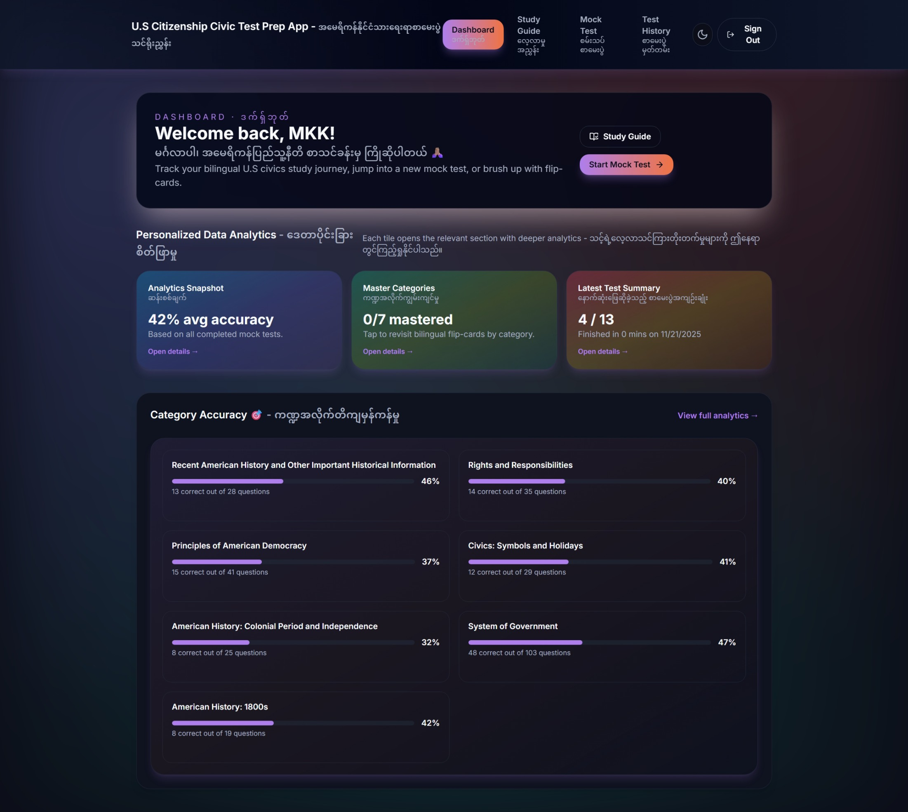
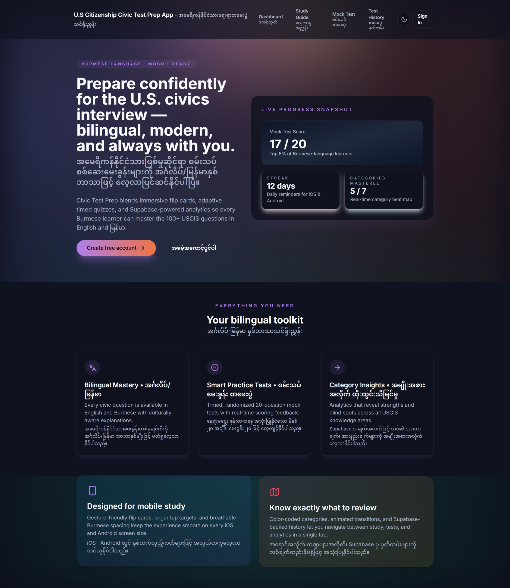
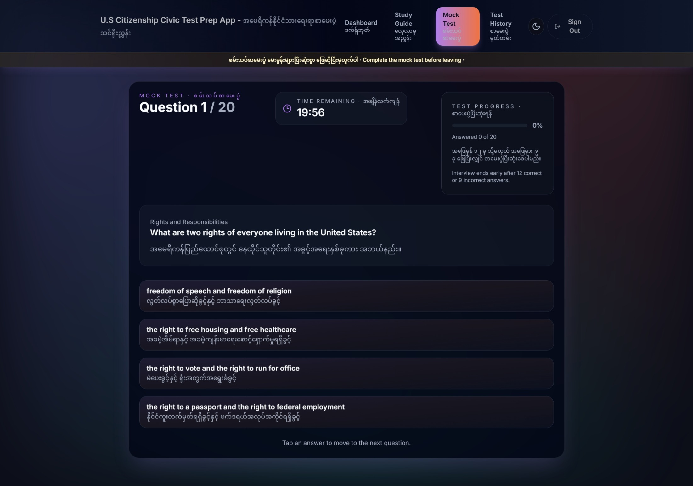
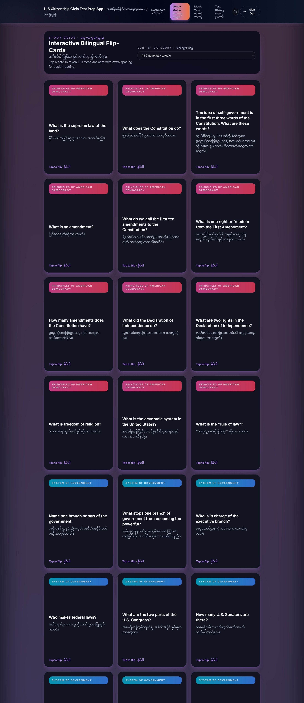
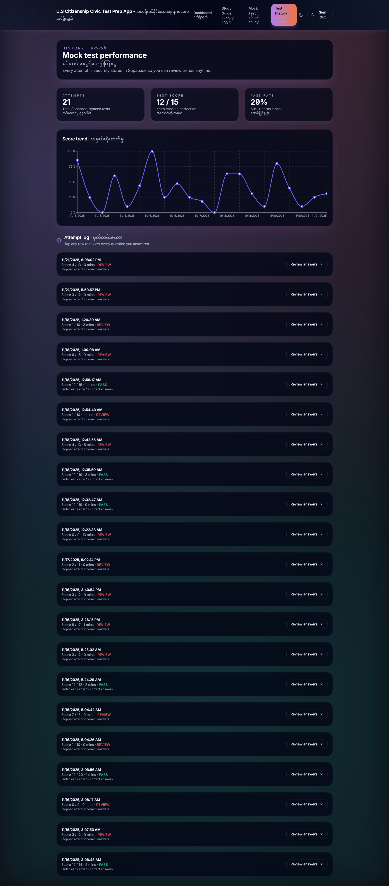

# Bilingual U.S. Citizenship Civics Quiz (2025 Edition)

A free, bilingual (English + Burmese) web app designed to help **Burmese-speaking immigrants** prepare for the U.S. Citizenship Civics Test. Built as an installable PWA with offline support, spaced repetition, interview simulation, and multi-sensory celebration feedback.

**Live at [civic-test-2025.vercel.app](https://civic-test-2025.vercel.app/)**

---

## Purpose & Vision

- **Accessibility** — Bilingual study resources for Burmese immigrants preparing for the USCIS civics test
- **Education** — Understanding rights, responsibilities, and history beyond test preparation
- **Community Empowerment** — Free, open-source platform removing financial barriers
- **Inclusivity** — English-only mode or bilingual (English + Burmese) mode across the entire app

---

## Screenshots

<p align="center">
  
  
  
  
  
</p>

---

## Features

### Study Modes (5 ways to learn)

- **Mock Test** — 20 random questions from 128, timed at 20 minutes, USCIS simulation format with pass/fail scoring
- **Category Practice** — Focus on weak areas across 7 civics categories with Duolingo-style Check/Continue flow
- **Flashcard Sort** — Swipeable Know/Don't Know cards with multi-round drilling of missed questions
- **Spaced Repetition (SRS)** — FSRS algorithm (ts-fsrs) with IndexedDB persistence and Supabase cloud sync
- **Interview Simulation** — Chat-style practice with animated examiner, speech recognition, Practice/Real USCIS modes, and per-answer confidence scoring

### Content

- **128 USCIS 2025 questions** across 7 categories with bilingual explanations
- **256 pre-generated Burmese audio files** via edge-tts for offline TTS
- **State-aware answers** — dynamic content for questions like "Who is your governor?"
- **About page** honoring Dwight D. Clark (Volunteers in Asia) and Dorothy & James Guyot (Pre-Collegiate Program) with bilingual dedication cards

### UX & Design

- **iOS-inspired glass-morphism** with 3-tier system (light/medium/heavy), prismatic borders, and frosted dark mode
- **Multi-sensory celebrations** — choreographed confetti, DotLottie animations, Web Audio harmonics, haptic feedback across 4 intensity tiers (sparkle/burst/celebration/ultimate)
- **Spring physics** (motion/react) for button press tiers, staggered lists, card animations, and page transitions
- **Skeleton screens, empty states, inline error recovery** — polished loading/error/zero-data experiences
- **3D flip cards** with real perspective, back-face visibility, and per-face pointer event management

### Mobile & PWA

- **Installable PWA** with service worker (Serwist), offline study mode, and push notifications
- **Native mobile feel** — overscroll guard, safe area insets (Dynamic Island), haptic feedback, swipe-to-dismiss toasts
- **10 IndexedDB stores** for offline-first data (SRS deck, sessions, bookmarks, sync queue)
- **Portrait orientation lock** during interviews and tests

### Accessibility (WCAG 2.2)

- **Screen reader support** — aria-live announcements for celebrations, badges, quiz feedback
- **Focus management** — auto-focus on route changes, modal focus traps, focus return on dismiss
- **Reduced motion** — all animations respect `prefers-reduced-motion` with non-motion alternatives
- **Keyboard navigation** — full quiz flow, timer extension, high contrast mode
- **44px minimum touch targets** on all interactive elements

### Study Guidance

- **Test readiness score** (0-100%) with accuracy, coverage, and consistency dimensions
- **Weak-area drill mode** with 3 entry points and pre/post mastery delta tracking
- **Test date countdown** with adaptive daily study targets
- **Category-level drill buttons** for below-threshold categories

### Content Enrichment

- **Mnemonics** with lightbulb icon and amber accent border for all 128 questions
- **Fun facts, common mistakes, citations** enriching every question
- **7 category study tips** as dismissible bilingual cards
- **Tricky Question badges** and Related Question chips linking similar content

### Cross-Device Sync

- **Settings, bookmarks, streaks, answer history** sync via Supabase
- **Visibility-based re-pull** on tab focus with 5s throttle
- **Login hydration** for instant sync on new device

### Authentication & Social

- **Supabase Auth** with email/password and Google One Tap OAuth
- **Privacy-first leaderboard** — opt-in with Row Level Security
- **Study streaks, badges, milestone celebrations** with Canvas-rendered share cards
- **Cross-device bookmark sync** with dedicated IndexedDB store and Supabase backup

### Security

- **Nonce-based CSP** with strict-dynamic (App Router proxy.ts generates per-request nonces)
- **PII sanitization** before Sentry error reporting
- **JWT-verified push API** with rate limiting
- **104-item security checklist** — 93 pass, 5 fixed, 5 acceptable risk
- **withRetry/safeAsync** async utilities for transient failure recovery with exponential backoff

---

## Tech Stack

| Layer | Technology |
|-------|-----------|
| Framework | Next.js 16 (App Router) + React 19 |
| Language | TypeScript 5.9 (strict, zero `any`) |
| Styling | Tailwind CSS 3 + CSS custom property design tokens |
| Animation | motion/react (spring physics) + canvas-confetti + DotLottie |
| Auth | Supabase Auth (email + Google OAuth) |
| Database | Supabase (PostgreSQL + RLS) |
| Offline | IndexedDB (idb-keyval) + Serwist service worker |
| SRS | ts-fsrs (Free Spaced Repetition Scheduler) |
| Audio | Web Audio API (celebration sounds) + edge-tts (Burmese MP3s) |
| Error Tracking | Sentry (error boundaries, Web Vitals, fingerprinting) |
| UI Primitives | Radix UI (Dialog, Toast, Progress) |
| Routing | Next.js App Router (file-based routing) |
| Package Manager | pnpm 10.28 |
| Deployment | Vercel |

---

## Architecture

```
App Router (Next.js 16)
  ├── app/layout.tsx (Server Component root)
  │     └── ClientProviders (10 nested contexts)
  │           └── NavigationShell + file-based routes
  ├── app/(protected)/ (auth guard layout)
  │     └── /home, /study, /test, /practice, /drill, ...
  ├── app/auth/ (public)
  └── app/api/push/ (Route Handlers)
```

**Provider hierarchy (10 nested contexts):**
```
ErrorBoundary → LanguageProvider → ThemeProvider → TTSProvider → ToastProvider
→ OfflineProvider → AuthProvider → SocialProvider → SRSProvider → StateProvider
→ NavigationProvider → NavigationShell → Routes
```

**Offline-first pattern:** IndexedDB primary storage → Supabase sync when online → sync queue for offline writes → withRetry for transient failures.

---

## Getting Started

### Prerequisites

- Node.js 18+
- pnpm (`npm install -g pnpm`)
- Supabase project (for auth and cloud sync)
- Sentry account (optional, for error monitoring)

### Installation

```bash
git clone https://github.com/min-hinthar/civic-test-2025
cd civic-test-2025
pnpm install
```

### Environment Variables

Copy `.env.example` and fill in your credentials:

```bash
cp .env.example .env.local
```

Required variables:
- `NEXT_PUBLIC_SUPABASE_URL` — Supabase project URL
- `NEXT_PUBLIC_SUPABASE_ANON_KEY` — Supabase anonymous key
- `NEXT_PUBLIC_GOOGLE_CLIENT_ID` — Google OAuth client ID
- `NEXT_PUBLIC_SENTRY_DSN` — Sentry DSN (optional)
- `NEXT_PUBLIC_VAPID_PUBLIC_KEY` — Push notification VAPID key (optional)

### Development

```bash
pnpm dev          # Start dev server at localhost:3000
pnpm build        # Production build
pnpm lint         # ESLint
pnpm typecheck    # TypeScript check
pnpm test         # Vitest (watch mode)
pnpm test:run     # Vitest (single run)
```

### Deployment

Optimized for **Vercel**:

1. Connect the repo in the Vercel dashboard
2. Set environment variables (see above)
3. Deploy — Vercel auto-detects Next.js

| Setting | Value |
|---------|-------|
| Build command | `pnpm build` |
| Output directory | `.next` |
| Node.js version | 18+ |
| Framework preset | Next.js |

The build chain is `@serwist/next` (PWA) wrapping `@sentry/nextjs` (error tracking) in `next.config.mjs`. Uses the `--webpack` flag for Sentry + Serwist plugin compatibility (Turbopack not yet supported).

---

## Project Scale

| Metric | Value |
|--------|-------|
| Milestones shipped | 5 (v1.0, v2.0, v2.1, v3.0, v4.0) |
| Phases completed | 48 |
| Plans executed | 278 |
| Requirements validated | 226/227 |
| TypeScript LOC | 78,000+ |
| Tests passing | 618 |
| USCIS questions | 128 (all with bilingual explanations) |
| Burmese audio files | 256 pre-generated MP3s |
| IndexedDB stores | 10 |
| Security checklist items | 104 |

---

## Development Journey

This project was built iteratively across 5 milestones over ~4 weeks using a structured planning methodology (GSD workflow). Each milestone went through requirements definition, phase planning, execution with atomic commits, verification, and audit before archival.

**AI-assisted development:** Built with Claude Code (Anthropic) for architecture design, implementation, code review, and quality assurance. Human oversight focused on product direction, UX decisions, security review, and accessibility standards.

---

## Contributing

Contributions are welcome!

1. Fork the repo
2. Create a feature branch (`git checkout -b feat/your-feature`)
3. Commit with conventional format (`feat(scope): description`)
4. Submit a pull request

Pre-commit hooks run ESLint + Prettier on staged TypeScript files.

---

## License

Licensed under the MIT License — free to use, modify, and distribute.

## Author

**Min Hinthar** — [@min-hinthar](https://github.com/min-hinthar)

Building bilingual educational tools, workflow automation, and civic education accessibility.

---

*Dedicated to Dwight D. Clark, founder of Volunteers in Asia at Stanford University, and Dorothy & James Guyot, founders of the Pre-Collegiate Program in Yangon — whose work connecting cultures inspired this project.*
